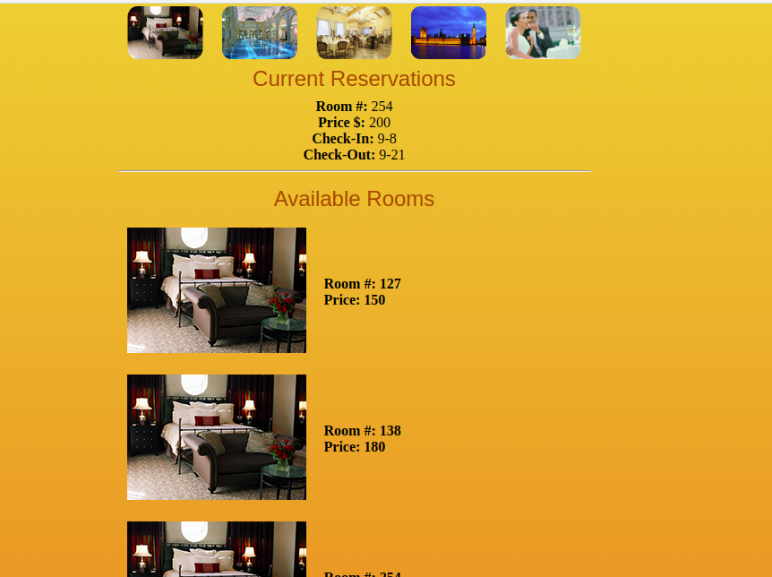
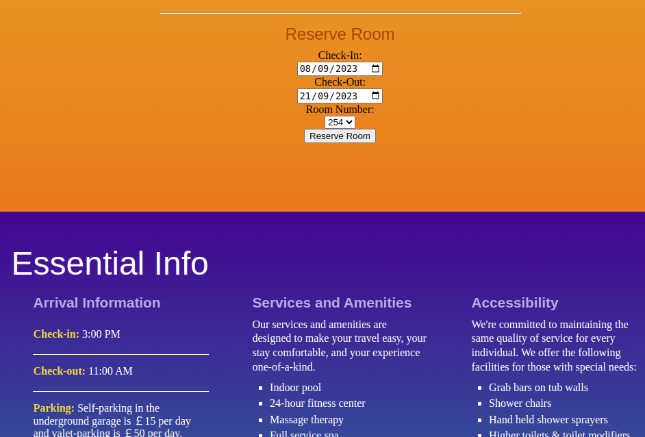

# ReservationApp

This project was generated with [Angular CLI](https://github.com/angular/angular-cli) version 16.2.1.

## How to run this app:

- You must have `NodeJS` and `npm` installed in your PC

```script
# sudo apt install nodejs
```

- Execute this command in the root workspace to download `node_modules` folder

```script
# npm install
```

- Execute this command to get the `Angular Application` up and running 

```script
# ng serve --o
```

- Home Page of Landon Hotel


- List of reservations and available rooms



- Just make a reservation




# ReservationApi

This project was written in Spring Webflux, using a MongoDB in memory

## How to run this api:

- You must have Java 12 installed in your PC. If you have SDK Man, run this command in the same folder which is `build.gradle` file

```script 
# sdk use java 12.0.2-open
```

- And then execute this command and the api will be served in the `http://localhost:8080/api/v1/reservations`

```script 
# ./gradlew bootRun
```

